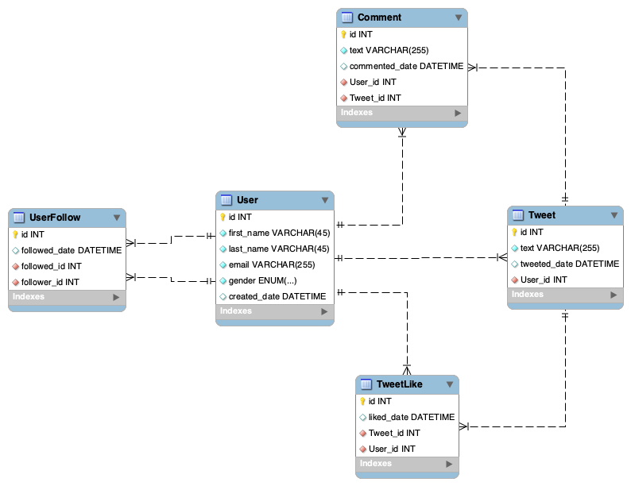

# stateful-stream-processing
[](https://github.com/farbodahm/stateful-stream-processing/actions/)
[](https://github.com/farbodahm/stateful-stream-processing/actions/)
[](https://github.com/farbodahm/stateful-stream-processing/actions/)

My university proposal on Stateful Stream Processing

- [stateful-stream-processing](#stateful-stream-processing)
  - [Problem Description](#problem-description)
    - [Architecture](#architecture)
    - [Architecture - AWS Deployment](#architecture---aws-deployment)
    - [Architecture - Dev Env](#architecture---dev-env)
  - [Development Environment](#development-environment)
  - [Interesting Information from Twitter model](#interesting-information-from-twitter-model)

## Problem Description
TODO

### Architecture

TODO

### Architecture - AWS Deployment

TODO

### Architecture - Dev Env

TODO

## Development Environment
To run the project in dev env, make sure you have [Docker]([dasd](https://docs.docker.com/get-docker/))
and [Docker-Compose](https://docs.docker.com/compose/install/) installed.
Then, to run the infrastructure for Kafka and Database, run:

```bash
docker-compose -f infra.docker-compose.yml up
```

Wait for few minutes and after you see logs related to Kafka working normally, then run the producer and consumer applications:

```bash
docker-compose -f app.docker-compose.yml up
```

This will run the applications.
If you changed any part of the applications, including `producer`, `consumer` or `processor` you need to re-build the Docker images.

```bash
docker-compose -f app.docker-compose.yml up --build
```

If you wanted to tear down everything, then simply run:
```bash
docker-compose -f infra.docker-compose.yml down
docker-compose -f app.docker-compose.yml down
```

**NOTE:** This will also deletes all of the Kafka topics and database, Be careful if you want keep the data produced in it.

## Interesting Information from Twitter model



There are many interesting pieces of information that can be extracted from these tables depending on the specific requirements of your project or analysis. Here are a few examples:

* *User Activity*: From the 'Tweets' and 'Comments' tables, we can derive how active each user is. We can calculate metrics like the average number of tweets per user, most active users, or the number of comments per tweet. We can also analyze user activity over time to identify trends or periods of high activity.

* *Most Popular Tweets*: By using the 'TweetLikes' table, we can identify the most popular tweets based on the number of likes. We can also see which users get the most likes on their tweets, giving us an idea of influential users within the platform.

* *Social Network Analysis*: From the 'UserFollow' table, we can perform social network analysis. This could involve determining who the most influential users are (those with the most followers), identifying clusters of users that tend to follow each other, or even using this data to suggest new users to follow based on a user's existing followees.

* *User Engagement*: By combining information from 'Tweets', 'Comments', and 'TweetLikes', we can derive how engaging each user is. For instance, users who have a higher ratio of likes and comments per tweet could be considered more engaging.

* *Popular Topics*: By analyzing the text of tweets from the 'Tweets' table, we could identify trending topics or commonly mentioned phrases or keywords.

* *User Interaction*: From the 'Comments' table, we can analyze user interactions. For instance, we could identify pairs of users who often interact with each other or discover the types of tweets that generate the most discussion.

* *Demographics*: If the 'Users' table includes demographic information (like location, age, or gender), we could analyze Twitter use and behavior by demographic group.

